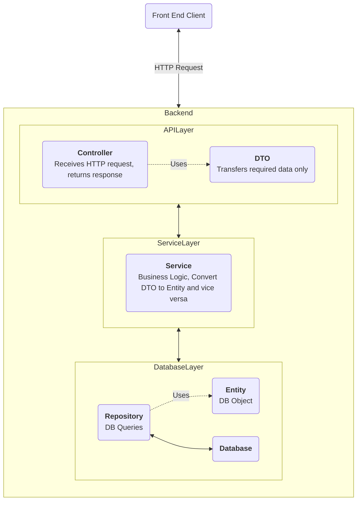
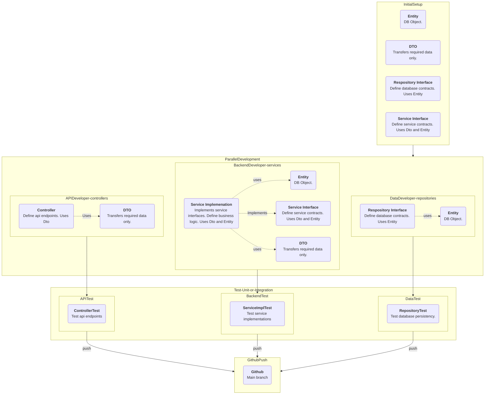

# Backend — Spring Boot application for the Digital Signage project

### Backend Architecture

```mermaid
flowchart TD


    Entity(<b>Entity</b><br/>DB Object)

    DTO(<b>DTO</b><br/>Transfers required data only)


    A(Front End Client) <--HTTP Request---->Backend


    subgraph Backend
        direction TB
        subgraph APILayer
            B(<b>Controller</b><br/>Receives HTTP request, returns response)
            B-.->|Uses|DTO
        end
        subgraph ServiceLayer
            C(<b>Service</b><br/>Business Logic, Convert DTO to Entity and vice versa)
        end
        subgraph DatabaseLayer
            direction LR
            D(<b>Repository</b><br/>DB Queries) <-->Database(<b>Database</b>)


            D-.->|Uses|Entity
        end

        APILayer <-->ServiceLayer


        ServiceLayer <-->DatabaseLayer


    end
```

### Parallel Programming and File Structure

```mermaid
flowchart TD
    subgraph InitialSetup
        Entity1(<b>Entity</b><br/>DB Object.)
        DTO1(<b>DTO</b><br/>Transfers required data only.)
        Repository1(<b>Respository Interface</b><br/>Define database contracts. Uses Entity)
        Service1(<b>Service Interface</b><br/>Define service contracts. Uses Dto and Entity)
    end

    subgraph ParallelDevelopment
        direction LR

        subgraph APIDeveloper-controllers
            DTO2(<b>DTO</b><br/>Transfers required data only.)
            Controller2(<b>Controller</b><br/>Define api endpoints. Uses Dto)
            Controller2-.->|Uses|DTO2
        end


        subgraph BackendDeveloper-services
            Entity3(<b>Entity</b><br/>DB Object.)
            DTO3(<b>DTO</b><br/>Transfers required data only.)
            Service3(<b>Service Interface</b><br/>Define service contracts. Uses Dto and Entity)
            Service3Impl(<b>Service Implemenation</b><br/>Implements service interfaces. Define business logic. Uses Dto and Entity)
        
            Service3Impl-.->|Implements|Service3
            Service3Impl-.->|uses|Entity3
            Service3Impl-.->|uses|DTO3
        end


        subgraph DataDeveloper-repositories
            Entity4(<b>Entity</b><br/>DB Object.)
            Repository4(<b>Respository Interface</b><br/>Define database contracts. Uses Entity)
            
            Repository4-.->|uses|Entity4
        end
    end

    InitialSetup-->ParallelDevelopment

    subgraph Test-Unit-or-Integration
        subgraph APITest
            ControllerTest(<b>ControllerTest</b><br/>Test api endpoints)
        end
        subgraph BackendTest
            ServiceImplTest(<b>ServiceImplTest</b><br/>Test service implementations)
        
        end
        subgraph DataTest
            RepositoryTest(<b>RepositoryTest</b><br/>Test database persistency.)
        end
    end

    subgraph GithubPush
        Github(<b>Github</b><br/>Main branch)
    end

    APIDeveloper-controllers-->APITest

    BackendDeveloper-services-->BackendTest

    DataDeveloper-repositories-->DataTest

    APITest--push-->GithubPush

    BackendTest--push-->GithubPush

    DataTest--push-->GithubPush
    
```