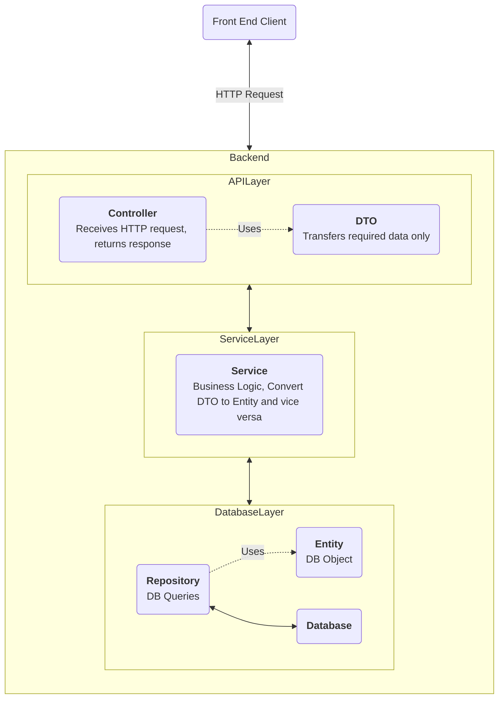

# Backend — Spring Boot application for the Digital Signage project

### Backend Architecture

```mermaid
flowchart TD


    Entity(<b>Entity</b><br/>DB Object)
        
    DTO(<b>DTO</b><br/>Transfers required data only)


    A(Front End Client) <--HTTP Request---->Backend


    subgraph Backend
        direction TB
        subgraph APILayer
            B(<b>Controller</b><br/>Receives HTTP request, returns response)
            B-.->|Uses|DTO
        end
        subgraph ServiceLayer
            C(<b>Service</b><br/>Business Logic, Convert DTO to Entity and vice versa)
        end
        subgraph DatabaseLayer
            direction LR
            D(<b>Repository</b><br/>DB Queries) <-->Database(<b>Database</b>)
            


            D-.->|Uses|Entity
        end

        APILayer <-->ServiceLayer
       

        ServiceLayer <-->DatabaseLayer


    end
```