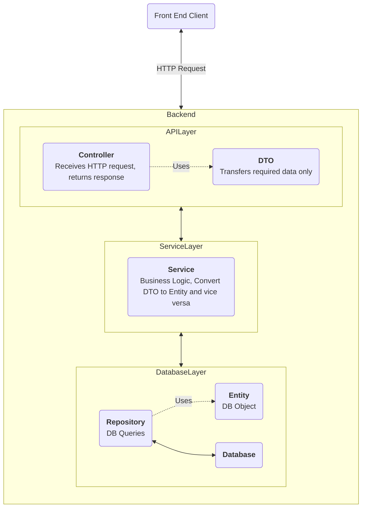
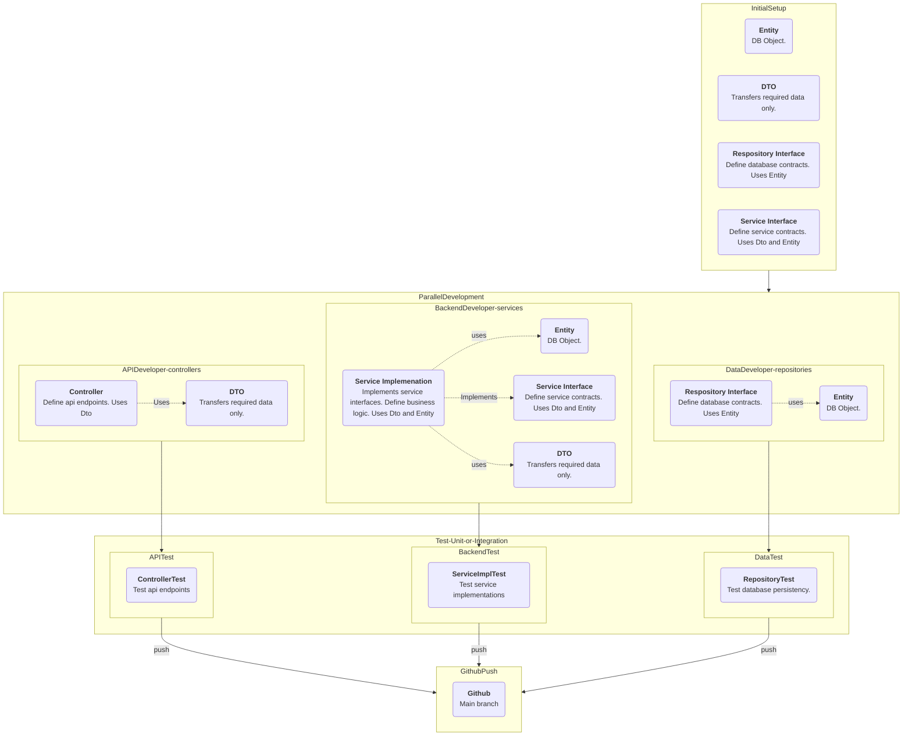
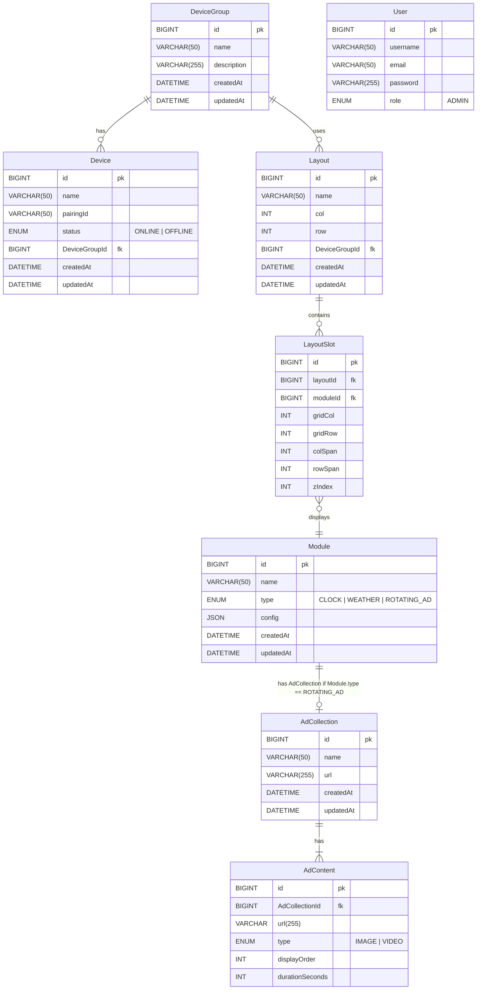

# Backend — Spring Boot application for the Digital Signage project

### Backend Architecture

### Parallel Programming and File Structure

**Initial Setup:**

The initial setup needs to be done first. All backend developers must agree on these setups before starting any parallel development.
-Set up the database schema (Database Entities).
-Set up Data Transfer Objects (DTOs). Not everything saved in the database needs to be exposed to the end user or developer to maintain security.
-The repository interface needs to be set up with the required contracts.
-The service interface needs to be set up with the required contracts.

**Note:** All developers (frontend and backend) need to agree on this phase. After we pass this initial setup phase, all backend development should be decoupled, meaning that throughout the parallel development process, we won't need to wait for another developer to complete their work.

**Parallel Development:**

-The API developer will develop all the controllers.
-The backend developer will develop all the services with business logic and will implement the service interface set up earlier.
-The data developer will add any custom queries if required. The amount of work here is smaller if the initial repository interface set up earlier is sufficient.

**Note:**

-The API developer can only use DTOs.
-The backend developer can use both DTOs and entities in their development.
-The data developer will only rely on the entities.

**Testing:**

Each developer will write their own test code and modular test methods to ensure everything is working as expected. There may also be a dedicated tester to write test scripts.

**Merging to GitHub Main Branch:**

Every time someone does a pull request, run all the tests! Even though some tests might not be part of the work being merged, we should run all tests to make sure that someone's development didn't break another part of the software. The same process should be followed even if there is only a single line of code change. **Run all the tests and make sure they all pass.**

## Database Architecture ERD

### Database Name: digitalsignagedb

