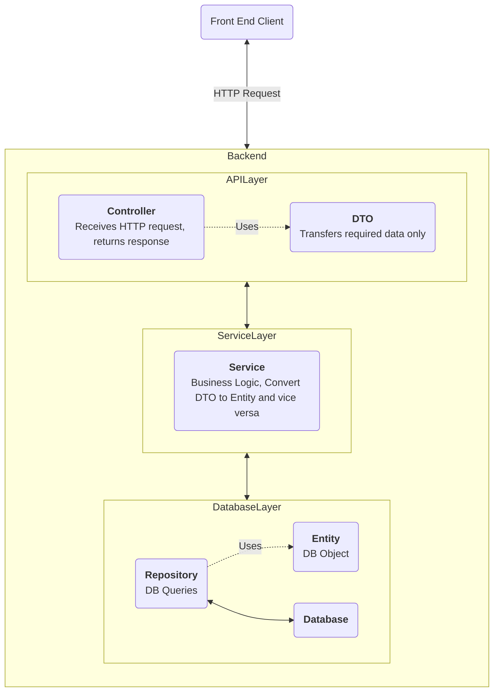
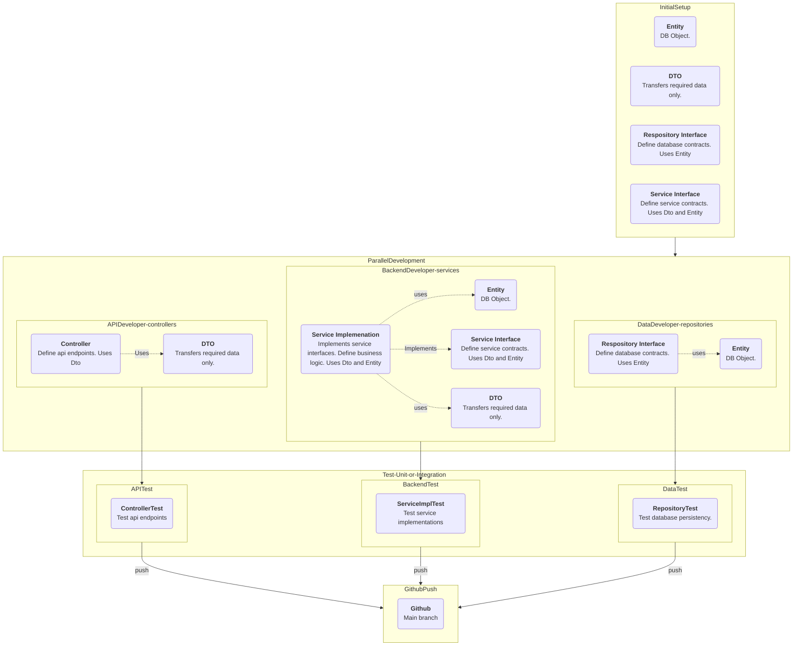
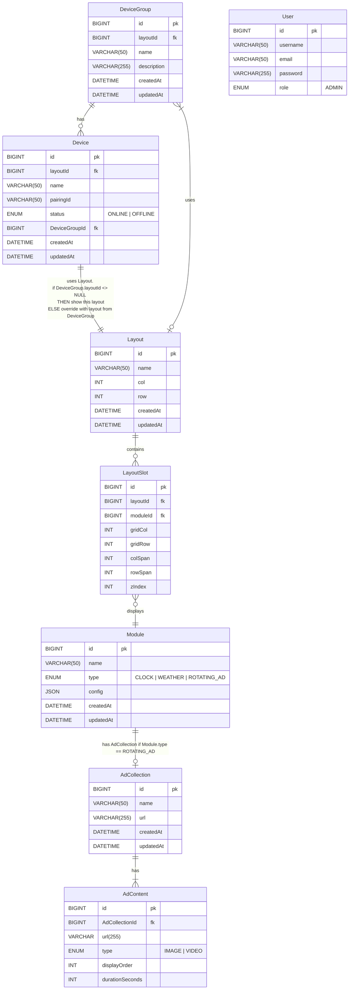

# Backend — Spring Boot application for the Digital Signage project

### Backend Architecture

### Parallel Programming and File Structure

**Initial Setup:**

The initial setup needs to be done first. All backend developers must agree on these setups before starting any parallel development.
-Set up the database schema (Database Entities).
-Set up Data Transfer Objects (DTOs). Not everything saved in the database needs to be exposed to the end user or developer to maintain security.
-The repository interface needs to be set up with the required contracts.
-The service interface needs to be set up with the required contracts.

**Note:** All developers (frontend and backend) need to agree on this phase. After we pass this initial setup phase, all backend development should be decoupled, meaning that throughout the parallel development process, we won't need to wait for another developer to complete their work.

**Parallel Development:**

-The API developer will develop all the controllers.
-The backend developer will develop all the services with business logic and will implement the service interface set up earlier.
-The data developer will add any custom queries if required. The amount of work here is smaller if the initial repository interface set up earlier is sufficient.

**Note:**

-The API developer can only use DTOs.
-The backend developer can use both DTOs and entities in their development.
-The data developer will only rely on the entities.

**Testing:**

Each developer will write their own test code and modular test methods to ensure everything is working as expected. There may also be a dedicated tester to write test scripts.

**Merging to GitHub Main Branch:**

Every time someone does a pull request, run all the tests! Even though some tests might not be part of the work being merged, we should run all tests to make sure that someone's development didn't break another part of the software. The same process should be followed even if there is only a single line of code change. **Run all the tests and make sure they all pass.**

## Database Architecture ERD

### Database Name: digitalsignagedb

## API Endpoints

### Authentication
<table>
    <tr>
        <th>Method</th>
        <th>API Endpoint</th>
        <th>Description</th>
    </tr>
    <tr>
        <td>POST</td><td>/api/auth/login</td>
        <td>Takes <b>username</b> and <b>password</b> returns a JWT token.</td>
    </tr>
    <tr>
        <td>GET</td><td>/api/auth/user</td>
        <td>Returns the currently logged in user info based on the JWT token.</td>
    </tr>
    <tr>
        <td>POST</td><td>/api/auth/logout</td>
        <td>Destroy the JWT token</td>
    </tr>
</table>

### Device
#### Base Path /api/devices
<table>
    <tr>
        <th>Method</th>
        <th>API Endpoint</th>
        <th>Description</th>
    </tr>
    <tr>
        <td>POST</td><td>/api/devices/register</td>
        <td>
            <ul>
                <li>Device boot first time and checks if the pairingId exists in local storage. If not, hit the endpoint</li>
                <li>Server will generate a random id and returns the id to the device.</li>
                <li>Save it in the device's local storage</li>
            </ul>
        </td>
    </tr>
    <tr>
        <td>POST</td><td>/api/devices/pair</td>
        <td>
            <ul>
                <li>Admin sees the pairingId on the device screen. Takes note of that id and enters it in the admin panel</li>
                <li>Hit this endpoint and server will register the pairingId</li>
            </ul>
        </td>
    </tr>
    <tr>
        <td>POST</td><td>/api/devices/verify-register</td>
        <td>
            <ul>
                <li>If device reboot and device has the pairingId in the local storage, hit this endpoint.</li>
                <li>Verify that the device is registered</li>
            </ul>
        </td>
    </tr>
    <tr>
        <td>GET</td><td>/api/devices/{id}/status</td>
        <td>Verify device status (online | offline).</td>
    </tr>
    <tr>
        <td>GET</td><td>/api/devices</td>
        <td>Returns list of all devices with their name, status, group.</td>
    </tr>
    <tr>
        <td>GET</td><td>/api/devices/{id}</td>
        <td>Returns a single device with their name, status, group.</td>
    </tr>
    <tr>
        <td>PATCH</td><td>/api/devices/{id}/group</td>
        <td>Reassign a device to a different group</td>
    </tr>
    <tr>
        <td>PATCH</td><td>/api/devices/{id}/status</td>
        <td>Updates device status i.e. online | offline</td>
    </tr>
    <tr>
        <td>DELETE</td><td>/api/devices/{id}</td>
        <td>Delete a device from the system.</td>
    </tr>
</table>

### DeviceGroups
#### Base Path /api/device-groups
<table>
    <tr>
        <th>Method</th>
        <th>API Endpoint</th>
        <th>Description</th>
    </tr>
    <tr>
        <td>GET</td><td>/api/device-groups</td>
        <td>Returns all device groups with their assigned layout and device count.</td>
    </tr>
    <tr>
        <td>POST</td><td>/api/device-groups</td>
        <td>Creates a new device group</td>
    </tr>
    <tr>
        <td>GET</td><td>/api/device-groups/{id}</td>
        <td>Returns a single device group with their assigned layout and device count.</td>
    </tr>
    <tr>
        <td>PUT</td><td>/api/device-groups/{id}</td>
        <td>Updates group name or description. Assigns or unassigns a layout.</td>
    </tr>
    <tr>
        <td>DELETE</td><td>/api/device-groups/{id}</td>
        <td>Deletes the group</td>
    </tr>
</table>

### Layouts
#### Base Path /api/layouts
<table>
    <tr>
        <th>Method</th>
        <th>API Endpoint</th>
        <th>Description</th>
    </tr>
    <tr>
        <td>GET</td><td>/api/layouts</td>
        <td>Returns all layouts</td>
    </tr>
    <tr>
        <td>POST</td><td>/api/layouts</td>
        <td>Creates a new layout.</td>
    </tr>
    <tr>
        <td>GET</td><td>/api/layouts/{id}</td>
        <td>Returns a layout and all its slots with their assigned modules. Fully resolved.</td>
    </tr>
    <tr>
        <td>PUT</td><td>/api/layouts/{id}</td>
        <td>Updates the layout info.</td>
    </tr>
    <tr>
        <td>DELETE</td><td>/api/layouts/{id}</td>
        <td>Deletes the layout.</td>
    </tr>
</table>

##### JSON Request and Response

    
<b>GET</b> /api/layouts

    RESPONSE 200

    {
        "status": 200,
        "message": "",
        "data": [

                    {
                        "id": 1,
                        "name": "Campus Center Default",
                        "col": 2,           // total number of columns
                        "row": 1,           // total number of rows
                        "createdAt": "2026-03-15T02:13:45:00Z",
                        "updatedAt": "2026-03-15T02:13:45:00Z"
                    },
            
                    {
                        "id": 2,
                        "name": "Test Layout",
                        "col": 2,           // total number of columns
                        "row": 3,           // total number of rows
                        "createdAt": "2026-03-15T02:13:45:00Z",
                        "updatedAt": "2026-03-15T02:13:45:00Z"
                    },
                ],
        "errors":[]
    }
    
    RESPONSE 500

    {
        "status": 500,
        "message": "Internal server error",
        "data": null,
        "errors":[
            {"error": "Unexpected error occurred"}
        ]
    }

    
<b>POST</b> /api/layouts

    REQUEST
    
    {
        "name": "Another Layout",
        "col": 2,           // total number of columns
        "row": 2,           // total number of rows
    }

    RESPONSE 201

    {
        "status": 201,
        "message": "Layout created successfully",
        "data": {
                    "id": 3,
                    "name": "Anohter Layout",
                    "col": 2,           // total number of columns
                    "row": 2,           // total number of rows
                    "createdAt": "2026-03-15T02:45:45:00Z",
                    "updatedAt": "2026-03-15T02:45:45:00Z"
                },
        "errors":[]
    }

    
    RESPONSE 400

    {
        "status": 400,
        "message": "Validation failed",
        "data": null,
        "errors":[
            {"error": "Grid column is not defined"}
        ]
    }
    

    
    RESPONSE 500

    {
        "status": 500,
        "message": "Internal server error",
        "data": null,
        "errors":[
            {"error": "Unexpected error occurred"}
        ]
    }

    
<b>GET</b> /api/layouts/3

    RESPONSE 200

    
    {
        "status": 200,
        "message": "",
        "data": {
                    "id": 3,
                    "name": "Anohter Layout",
                    "col": 2,           // total number of columns
                    "row": 2,           // total number of rows
                    "createdAt": "2026-03-15T02:45:45:00Z",
                    "updatedAt": "2026-03-15T02:45:45:00Z"
                },
        "errors":[]
    }

    
    RESPONSE 404

    {
        "status": 404,
        "message": "Layout not found",
        "data": null,
        "errors":[
            {"error": "Layout with id 3 doesn't exist"}
        ]
    }
    

    
    RESPONSE 500

    {
        "status": 500,
        "message": "Internal server error",
        "data": null,
        "errors":[
            {"error": "Unexpected error occurred"}
        ]
    }

    
<b>PUT</b> /api/layouts/3

    REQUEST
        {
            "name": "Updated Layout Name",
            "col": 2,
            "row": 2
        }

    RESPONSE 200

    
    {
        "status": 200,
        "message": "Layout updated successfully",
        "data": {
                    "id": 3,
                    "name": "Updated Layout Name",
                    "col": 2,           // total number of columns
                    "row": 2,           // total number of rows
                    "createdAt": "2026-03-15T02:45:45:00Z",
                    "updatedAt": "2026-03-15T03:10:45:00Z"
                },
        "errors":[]
    }

    
    RESPONSE 404

    {
        "status": 404,
        "message": "Layout not found",
        "data": null,
        "errors":[
            {"error": "Layout with id 3 doesn't exist"}
        ]
    }
    

    
    RESPONSE 500

    {
        "status": 500,
        "message": "Internal server error",
        "data": null,
        "errors":[
            {"error": "Unexpected error occurred"}
        ]
    }

    
<b>DELETE</b> /api/layouts/3

    RESPONSE 200

    {
        "status": 200,
        "message": "Layout deleted successfully.",
        "data": null,
        "errors":[]
    }

    
    RESPONSE 404

    {
        "status": 404,
        "message": "Layout not found",
        "data": null,
        "errors":[
            {"error": "Layout with id 3 doesn't exist"}
        ]
    }
    

    
    RESPONSE 500

    {
        "status": 500,
        "message": "Internal server error",
        "data": null,
        "errors":[
            {"error": "Unexpected error occurred"}
        ]
    }

### Layout Slots
#### Base Path /api/layouts/{id}/slots
<table>
    <tr>
        <th>Method</th>
        <th>API Endpoint</th>
        <th>Description</th>
    </tr>
    <tr>
        <td>GET</td><td>/api/layouts/{id}/slots</td>
        <td>Returns all layout slots</td>
    </tr>
    <tr>
        <td>GET</td><td>/api/layouts/{id}/slots/{slotId}</td>
        <td>Returns a layout slot.</td>
    </tr>
    <tr>
        <td>POST</td><td>/api/layouts/{id}/slots</td>
        <td>Add a new layout slot</td>
    </tr>
    <tr>
        <td>PUT</td><td>/api/layouts/{id}/slots/{slotId}</td>
        <td>Updates a layout slot</td>
    </tr>
    <tr>
        <td>DELETE</td><td>/api/layouts/{id}/slots/{slotId}</td>
        <td>Deletes a slot from the layout.</td>
    </tr>
</table>

##### JSON Request and Response

    
<b>GET</b> /api/layouts/1/slots

    RESPONSE 200

    {
        "status": 200,
        "message": "",
        "data": [
                    {
                        "id": 1,
                        "layoutId": 1,
                        "moduleId": 1,
                        "gridCol": 1,
                        "gridRow": 1,
                        "colSpan": 1,
                        "rowSpan": 1,
                        "zIndex": 1
                    },
                    {
                        "id": 2,
                        "layoutId": 2,
                        "moduleId": 2,
                        "gridCol": 2,
                        "gridRow": 1,
                        "colSpan": 1,
                        "rowSpan": 1,
                        "zIndex": 1
                    }
                ],
        "errors":[]
    }
    
    RESPONSE 500

    {
        "status": 500,
        "message": "Internal server error",
        "data": null,
        "errors":[
            {"error": "Unexpected error occurred"}
        ]
    }

    
<b>GET</b> /api/layouts/1/slots/1

    RESPONSE 200

    {
        "status": 200,
        "message": "",
        "data": {
                    "id": 1,
                    "layoutId": 1,
                    "moduleId": 2,
                    "gridCol": 1,
                    "gridRow": 1,
                    "colSpan": 1,
                    "rowSpan": 1,
                    "zIndex": 1
                },
        "errors":[]
    }

    
    RESPONSE 404

    {
        "status": 404,
        "message": "Layout slot not found",
        "data": null,
        "errors":[
            {"error": "Layout slot with id 1 doesn't exist"}
        ]
    }
    

    
    RESPONSE 500

    {
        "status": 500,
        "message": "Internal server error",
        "data": null,
        "errors":[
            {"error": "Unexpected error occurred"}
        ]
    }

    
<b>POST</b> /api/layouts/1/slots

    REQUEST
    {
        "layoutId": 1,
        "moduleId": 1,
        "gridCol": 1,
        "gridRow": 1,
        "colSpan": 1,
        "rowSpan": 1,
        "zIndex": 1

    }

    RESPONSE 201

    {
        "status": 201,
        "message": "Layout slot created successfully",
        "data": {
                    "id": 1,
                    "layoutId": 1,
                    "moduleId": 1,
                    "gridCol": 1,
                    "gridRow": 1,
                    "colSpan": 1,
                    "rowSpan": 1,
                    "zIndex": 1
                },
        "errors":[]
    }

    
    RESPONSE 400

    {
        "status": 400,
        "message": "Validation failed",
        "data": null,
        "errors":[
            {"error": "Grid column is not defined"},
            {"error": "Grid row is not defined"}
        ]
    }
    

    
    RESPONSE 500

    {
        "status": 500,
        "message": "Internal server error",
        "data": null,
        "errors":[
            {"error": "Unexpected error occurred"}
        ]
    }

    
<b>PUT</b> /api/layouts/1/slots/1

    REQUEST
    {
        "layoutId": 1,
        "moduleId": 2,      //updated
        "gridCol": 1,
        "gridRow": 1,
        "colSpan": 1,
        "rowSpan": 1,
        "zIndex": 1
    }

    RESPONSE 200

    {
        "status": 200,
        "message": "Layout slot updated successfully",
        "data": {
                    "id": 1,
                    "layoutId": 1,
                    "moduleId": 2,
                    "gridCol": 1,
                    "gridRow": 1,
                    "colSpan": 1,
                    "rowSpan": 1,
                    "zIndex": 1
                },
        "errors":[]
    }

    
    RESPONSE 404

    {
        "status": 404,
        "message": "Layout slot not found",
        "data": null,
        "errors":[
            {"error": "Layout slot with id 1 doesn't exist"}
        ]
    }
    

    
    RESPONSE 500

    {
        "status": 500,
        "message": "Internal server error",
        "data": null,
        "errors":[
            {"error": "Unexpected error occurred"}
        ]
    }

    
<b>DELETE</b> /api/layouts/1/slots/1

    RESPONSE 200

    {
        "status": 200,
        "message": "Layout slot deleted successfully.",
        "data": null,
        "errors":[]
    }

    
    RESPONSE 404

    {
        "status": 404,
        "message": "Layout slot not found",
        "data": null,
        "errors":[
            {"error": "Layout slot with id 1 doesn't exist"}
        ]
    }
    

    
    RESPONSE 500

    {
        "status": 500,
        "message": "Internal server error",
        "data": null,
        "errors":[
            {"error": "Unexpected error occurred"}
        ]
    }

