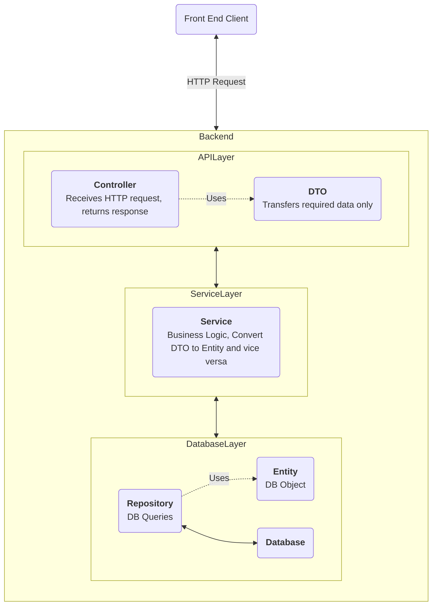
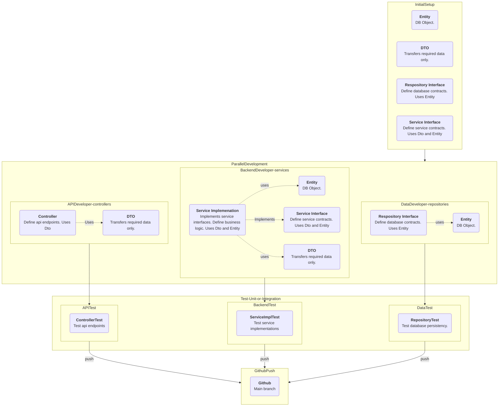
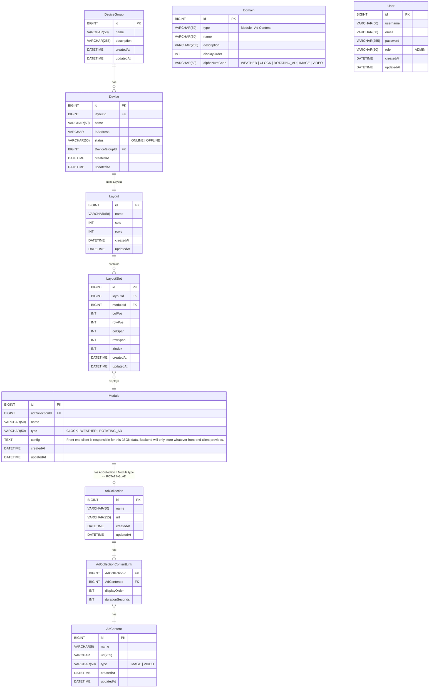
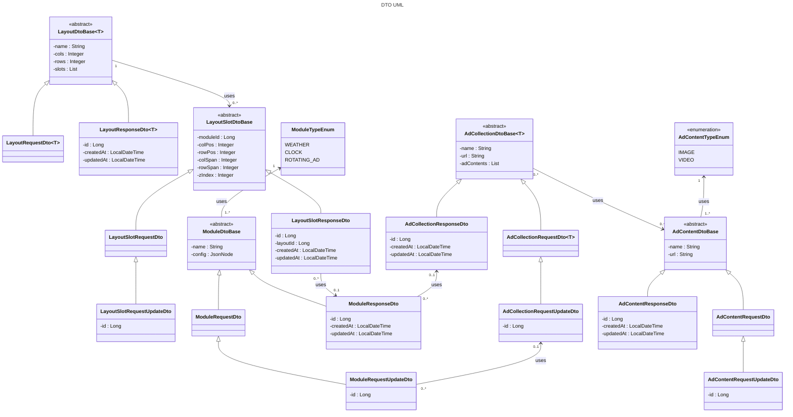
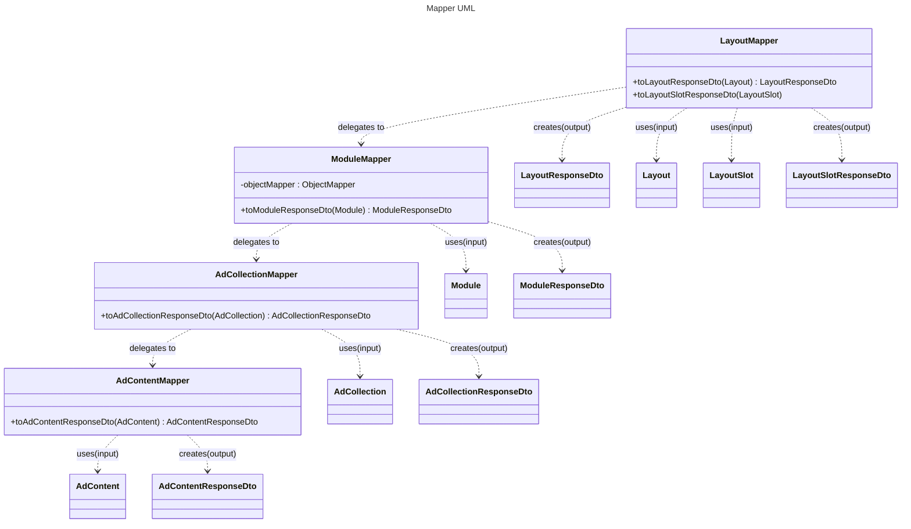

# Backend — Spring Boot application for the Digital Signage project

### Backend Architecture




### Parallel Programming and File Structure




**Initial Setup:**

The initial setup needs to be done first. All backend developers must agree on these setups before starting any parallel development.
-Set up the database schema (Database Entities).
-Set up Data Transfer Objects (DTOs). Not everything saved in the database needs to be exposed to the end user or developer to maintain security.
-The repository interface needs to be set up with the required contracts.
-The service interface needs to be set up with the required contracts.

**Note:** All developers (frontend and backend) need to agree on this phase. After we pass this initial setup phase, all backend development should be decoupled, meaning that throughout the parallel development process, we won't need to wait for another developer to complete their work.

**Parallel Development:**

-The API developer will develop all the controllers.
-The backend developer will develop all the services with business logic and will implement the service interface set up earlier.
-The data developer will add any custom queries if required. The amount of work here is smaller if the initial repository interface set up earlier is sufficient.

**Note:**

-The API developer can only use DTOs.
-The backend developer can use both DTOs and entities in their development.
-The data developer will only rely on the entities.

**Testing:**

Each developer will write their own test code and modular test methods to ensure everything is working as expected. There may also be a dedicated tester to write test scripts.

**Merging to GitHub Main Branch:**

Every time someone does a pull request, run all the tests! Even though some tests might not be part of the work being merged, we should run all tests to make sure that someone's development didn't break another part of the software. The same process should be followed even if there is only a single line of code change. **Run all the tests and make sure they all pass.**

## Database Architecture ERD

### Database Name: digitalsignagedb




## UML Diagrams

```mermaid
---
title: Entity UML
---

classDiagram

class Device{
    -Long id
    -String name
    -String ipAddress
    -LolcaDatetime createdAt
    -LocalDateTime updatedAt
}

class DeviceGroup{
    -Long id
    -String name
    -String description
    -LolcaDatetime createdAt
    -LocalDateTime updatedAt
}

class Layout{
    -Long id
    -String name
    -int cols
    -int rows
    -LocalDateTime createdAt
    -LocalDateTime updatedAt
    
    +addLayoutSlot(LayoutSlot) void
    +addLayoutSlots(List<LayoutSlot>) void
}

class LayoutSlot{
    -Long id
    -int colPos
    -int rowPos
    -int colSpan
    -int rowSpan
    -int zIndex
    -LocalDateTime createdAt
    -LocalDateTime updatedAt
    
    +LayoutSlot(Layout)
}

class Module{
    -Long id
    -String name
    -String config
    -LocalDateTime createdAt
    -LocalDateTime cupdatedAt
    
    +builder() ModuleBuilder
}


class AdCollection{
    -Long id
    -String name
    -String url
    -LocalDateTime createdAt
    -LocalDateTime updatedAt
}

class AdContent{
    -Long id
    -String name
    -String url
    -LocalDateTime createdAt
    -LocalDateTime updatedAt
}

class Domain{
    -Long id
    -String type
    -String name
    -String description
    -String alphaNumCode
    -int displayOrder
    -LocalDateTime createdAt
    -LocalDateTime updatedAt
}

DeviceGroup "1..*"-->"0..*" Layout : uses
DeviceGroup "1" --> "0..*" Device : uses

Device "1..*"-->"0..1" Layout : uses



Layout "1"*--"0..*" LayoutSlot : has
LayoutSlot "0..*" --> "1" Layout
LayoutSlot "0..*" --> "0..1" Module : uses


Module "0..*" --> "0..1" AdCollection : has
AdCollection "0..*" --> "0..*" AdContent : uses


Module "1..*" --> "1" Domain : uses
AdContent "1..*" --> "1" Domain : uses


```








## API Endpoints

### Authentication
<table>
    <tr>
        <th>Method</th>
        <th>API Endpoint</th>
        <th>Description</th>
    </tr>
    <tr>
        <td>POST</td><td>/api/auth/login</td>
        <td>Takes <b>username</b> and <b>password</b> returns a JWT token.</td>
    </tr>
    <tr>
        <td>GET</td><td>/api/auth/user</td>
        <td>Returns the currently logged in user info based on the JWT token.</td>
    </tr>
    <tr>
        <td>POST</td><td>/api/auth/logout</td>
        <td>Destroy the JWT token</td>
    </tr>
</table>

### Pairing
#### Base Path /api/devices
<table>
    <tr>
        <th>Method</th>
        <th>API Endpoint</th>
        <th>Description</th>
    </tr>
    <tr>
        <td>GET</td><td>/api/devices/register</td>
        <td>
            <ul>
                <li>Device boot first time and checks if the pairingId exists in local storage. If not, hit the endpoint</li>
                <li>Server will generate a random id and returns the id to the device.</li>
                <li>Save it in the device's local storage</li>
            </ul>
        </td>
    </tr>
    <tr>
        <td>POST</td><td>/api/devices/verify-register</td>
        <td>
            <ul>
                <li>If device reboot and device has the pairingId in the local storage, hit this endpoint.</li>
                <li>Verify that the device is registered. If not registered, then register using /api/devices/register endpoint</li>
            </ul>
        </td>
    </tr>
</table>


<details>
    <summary><b>GET</b> /api/devices/register</summary>

RESPONSE 201
```json
{
    "status": 200,
    "message": "",
    "data": {
                "pairingId": 1
            },
    "errors":[]
}
```


RESPONSE 500
```json
{
    "status": 500,
    "message": "Internal server error",
    "data": null,
    "errors":[
        {"error": "Unexpected error occurred"}
    ]
}
```
</details>


<details>
    <summary><b>POST</b> /api/devices/verify-register</summary>

REQUEST
```json
{
    "pairingId": 1
    
}
```
RESPONSE 200
```json
{
    "status": 200,
    "message": "Device already paired",
    "data": {
                "id": 1,
                "paired": true
            },
    "errors":[]
}

```

RESPONSE 200
```json
{
    "status": 200,
    "message": "Pending device pairing",
    "data": {
                "id": 1,
                "paired": false
            },
    "errors":[]
}
```
RESPONSE 404
```json
{
    "status": 404,
    "message": "Pairing id not found",
    "data": null,
    "errors":[
        {"error": "Pairing id with 1 doesn't exist"}
    ]
}

```

RESPONSE 500
```json
{
    "status": 500,
    "message": "Internal server error",
    "data": null,
    "errors":[
        {"error": "Unexpected error occurred"}
    ]
}
```
</details>


### Device
#### Base Path /api/devices
<table>
    <tr>
        <th>Method</th>
        <th>API Endpoint</th>
        <th>Description</th>
    </tr>
    <tr>
        <td>PATCH</td><td>/api/devices/{id}/pair</td>
        <td>
            <ul>
                <li>Admin sees the pairingId on the device screen. Takes note of that id and enters it in the admin panel</li>
                <li>Hit this endpoint and server will register the pairingId</li>
            </ul>
        </td>
    </tr>
    <tr>
        <td>GET</td><td>/api/devices/{id}/status</td>
        <td>Verify device status (online | offline).</td>
    </tr>
    <tr>
        <td>GET</td><td>/api/devices</td>
        <td>Returns list of all devices with their name, status, group.</td>
    </tr>
    <tr>
        <td>GET</td><td>/api/devices/{id}</td>
        <td>Returns a single device with their name, status, group.</td>
    </tr>
    <tr>
        <td>PATCH</td><td>/api/devices/{id}/group</td>
        <td>Reassign a device to a different group</td>
    </tr>
    <tr>
        <td>PATCH</td><td>/api/devices/{id}/status</td>
        <td>Updates device status i.e. online | offline</td>
    </tr>
    <tr>
        <td>DELETE</td><td>/api/devices/{id}</td>
        <td>Delete a device from the system.</td>
    </tr>
</table>

<details>
    <summary><b>PATCH</b> /api/devices/1/pair</summary>

REQUEST
```json
{
    "pairingId": 1,
    "paired": true
    
}
```
RESPONSE 200
```json
{
    "status": 200,
    "message": "Device paired successfully",
    "data": {
                "id": 1,
                "pairingId": 1,
                "pairing": {
                            "id": 1,
                            "paired": true
                        }
            },
    "errors":[]
}
```

RESPONSE 404
```json
{
    "status": 404,
    "message": "Device not found",
    "data": null,
    "errors":[
        {"error": "Device with id 1 doesn't exist"}
    ]
}
```
RESPONSE 404
```json
{
    "status": 404,
    "message": "Pairing id not found",
    "data": null,
    "errors":[
        {"error": "Pairing id with 1 doesn't exist"}
    ]
}

```

RESPONSE 500
```json
{
    "status": 500,
    "message": "Internal server error",
    "data": null,
    "errors":[
        {"error": "Unexpected error occurred"}
    ]
}
```
</details>


<details>
    <summary><b>GET</b> /api/devices/1/status</summary>

RESPONSE 200
```json
{
    "status": 200,
    "message": "",
    "data": {
                "id": 1,
                "layoutId": 1,
                "name": "Updated Name",
                "pairingId": 1,
                "status": "ONLINE",
                "deviceGroupId": 1,
                "createdAt": "2026-03-15T02:13:45:00Z",
                "updatedAt": "2026-03-15T02:13:45:00Z"
            },
    "errors":[]
}
```

RESPONSE 404
```json
{
    "status": 404,
    "message": "Device not found",
    "data": null,
    "errors":[
        {"error": "Device with id 1 doesn't exist"}
    ]
}
```


RESPONSE 500
```json
{
    "status": 500,
    "message": "Internal server error",
    "data": null,
    "errors":[
        {"error": "Unexpected error occurred"}
    ]
}
```
</details>

<details>
    <summary><b>GET</b> /api/devices</summary>

    RESPONSE 200

    {
        "status": 200,
        "message": "",
        "data": [
                    {
                        "id": 1,
                        "layoutId": 1,
                        "name: "Kiosk",
                        "pairingId": 1,
                        "status": "ONLINE",
                        "deviceGroupId": 1,
                        "createdAt": "2026-03-15T02:13:45:00Z",
                        "updatedAt": "2026-03-15T02:13:45:00Z"
                    },
                    {
                        "id": 2,
                        "layoutId": 1,
                        "name: "Television",
                        "pairingId": 2,
                        "status": "OFFILINE",
                        "deviceGroupId": 2,
                        "createdAt": "2026-03-15T02:13:45:00Z",
                        "updatedAt": "2026-03-15T02:13:45:00Z"
                    }
            ]
        "errors":[]
    }
    

    
    RESPONSE 500

    {
        "status": 500,
        "message": "Internal server error",
        "data": null,
        "errors":[
            {"error": "Unexpected error occurred"}
        ]
    }

</details>

<details>
    <summary><b>GET</b> /api/devices/1</summary>

RESPONSE 200
```json
{
    "status": 200,
    "message": "",
    "data": {
                "id": 1,
                "layoutId": 1,
                "name": "Updated Name",
                "pairingId": 1,
                "status": "ONLINE",
                "deviceGroupId": 1,
                "createdAt": "2026-03-15T02:13:45:00Z",
                "updatedAt": "2026-03-15T02:13:45:00Z",
                "deviceGroup": {
                                "id": 1,
                                "layoutId": 1,
                                "name": "Device Group Name",
                                "description": "A temporary description for this device group.",
                                "createdAt": "2026-03-15T02:13:45:00Z",
                                "updatedAt": "2026-03-15T02:13:45:00Z",
                                "layout": {
                                    "id": 1,
                                    "name": "Campus Center Default",
                                    "cols": 2,          
                                    "rows": 1,           
                                    "createdAt": "2026-03-15T02:13:45:00Z",
                                    "updatedAt": "2026-03-15T02:13:45:00Z",
                                    "slots": [
                                                        {
                                                            "id": 1,
                                                            "layoutId": 1,
                                                            "moduleId": 1,
                                                            "colPos": 1,
                                                            "rowPos": 1,
                                                            "colSpan": 1,
                                                            "rowSpan": 1,
                                                            "zIndex": 1
                                                        },
                                                        {
                                                            "id": 2,
                                                            "layoutId": 2,
                                                            "moduleId": 2,
                                                            "colPos": 2,
                                                            "rowPos": 1,
                                                            "colSpan": 1,
                                                            "rowSpan": 1,
                                                            "zIndex": 1
                                                        }
                                                    ]
                                    }

                            }
            },
    "errors":[]
}
```

RESPONSE 404
```json
{
    "status": 404,
    "message": "Device not found",
    "data": null,
    "errors":[
        {"error": "Device with id 1 doesn't exist"}
    ]
}
```


RESPONSE 500
```json
{
    "status": 500,
    "message": "Internal server error",
    "data": null,
    "errors":[
        {"error": "Unexpected error occurred"}
    ]
}
```
</details>


<details>
    <summary><b>PATCH</b> /api/devices/1/group</summary>

REQUEST
```json
{
    "deviceGroupId": 2
}
```
RESPONSE 200
```json
{
    "status": 200,
    "message": "Device group updated successfully",
    "data": {
                "id": 1,
                "layoutId": 1,
                "name": "Updated Name",
                "pairingId": 1,
                "status": "OFFLINE",
                "deviceGroupId": 2,
                "createdAt": "2026-03-15T02:13:45:00Z",
                "updatedAt": "2026-03-15T02:13:45:00Z",

                "deviceGroup": {
                                "id": 2,
                                "layoutId": 1,
                                "name": "Device Group Name",
                                "description": "A temporary description for this device group.",
                                "createdAt": "2026-03-15T02:13:45:00Z",
                                "updatedAt": "2026-03-15T02:13:45:00Z",
                                "layout": {
                                    "id": 1,
                                    "name": "Campus Center Default",
                                    "cols": 2,         
                                    "rows": 1,           
                                    "createdAt": "2026-03-15T02:13:45:00Z",
                                    "updatedAt": "2026-03-15T02:13:45:00Z",
                                    "slots": [
                                                        {
                                                            "id": 1,
                                                            "layoutId": 1,
                                                            "moduleId": 1,
                                                            "colPos": 1,
                                                            "rowPos": 1,
                                                            "colSpan": 1,
                                                            "rowSpan": 1,
                                                            "zIndex": 1
                                                        },
                                                        {
                                                            "id": 2,
                                                            "layoutId": 2,
                                                            "moduleId": 2,
                                                            "colPos": 2,
                                                            "rowPos": 1,
                                                            "colSpan": 1,
                                                            "rowSpan": 1,
                                                            "zIndex": 1
                                                        }
                                                    ]
                                    }

                            }
            },
    "errors":[]
}
```

RESPONSE 404
```json
{
    "status": 404,
    "message": "Device not found",
    "data": null,
    "errors":[
        {"error": "Device with id 1 doesn't exist"}
    ]
}
```


RESPONSE 500
```json
{
    "status": 500,
    "message": "Internal server error",
    "data": null,
    "errors":[
        {"error": "Unexpected error occurred"}
    ]
}
```
</details>

<details>
    <summary><b>PATCH</b> /api/devices/1/status</summary>

REQUEST

{
    "status": "OFFLINE"
}

RESPONSE 200

{
    "status": 200,
    "message": "Device status updated successfully",
    "data": {
                "id": 1
                "layoutId": 1,
                "name: "Updated Name",
                "pairingId": 1,
                "status": "OFFLINE",
                "deviceGroupId": 1,
                "createdAt": "2026-03-15T02:13:45:00Z",
                "updatedAt": "2026-03-15T02:13:45:00Z",
            },
    "errors":[]
}


RESPONSE 404

{
    "status": 404,
    "message": "Device not found",
    "data": null,
    "errors":[
        {"error": "Device with id 1 doesn't exist"}
    ]
}


RESPONSE 500

{
    "status": 500,
    "message": "Internal server error",
    "data": null,
    "errors":[
        {"error": "Unexpected error occurred"}
    ]
}

</details>


<details>
    <summary><b>DELETE</b> /api/devices/1</summary>


    RESPONSE 200

    {
        "status": 200,
        "message": "Device deleted successfully.",
        "data": null,
        "errors":[]
    }

    
    RESPONSE 404

    {
        "status": 404,
        "message": "Device not found",
        "data": null,
        "errors":[
            {"error": "Device with id 1 doesn't exist"}
        ]
    }
    

    
    RESPONSE 500

    {
        "status": 500,
        "message": "Internal server error",
        "data": null,
        "errors":[
            {"error": "Unexpected error occurred"}
        ]
    }

</details>

### DeviceGroups
#### Base Path /api/device-groups
<table>
    <tr>
        <th>Method</th>
        <th>API Endpoint</th>
        <th>Description</th>
    </tr>
    <tr>
        <td>GET</td><td>/api/device-groups</td>
        <td>Returns all device groups with their assigned layout and device count.</td>
    </tr>
    <tr>
        <td>POST</td><td>/api/device-groups</td>
        <td>Creates a new device group</td>
    </tr>
    <tr>
        <td>GET</td><td>/api/device-groups/{id}</td>
        <td>Returns a single device group with their assigned layout and device count.</td>
    </tr>
    <tr>
        <td>PUT</td><td>/api/device-groups/{id}</td>
        <td>Updates group name or description. Assigns or unassigns a layout.</td>
    </tr>
    <tr>
        <td>DELETE</td><td>/api/device-groups/{id}</td>
        <td>Deletes the group</td>
    </tr>
</table>


<details>
    <summary><b>GET</b> /api/device-groups</summary>

    RESPONSE 200

    {
        "status": 200,
        "message": "",
        "data": [{
                    "id": 1,
                    "layoutId": 1,
                    "name": "Device Group Name",
                    "description": "A temporary description for this device group.",
                    "createdAt": "2026-03-15T02:13:45:00Z",
                    "updatedAt": "2026-03-15T02:13:45:00Z",
                    "layout": {
                        "id": 1,
                        "name": "Campus Center Default",
                        "cols": 2,           // total number of columns
                        "rows": 1,           // total number of rows
                        "createdAt": "2026-03-15T02:13:45:00Z",
                        "updatedAt": "2026-03-15T02:13:45:00Z",
                        "slots": [
                                            {
                                                "id": 1,
                                                "layoutId": 1,
                                                "moduleId": 1,
                                                "colPos": 1,
                                                "rowPos": 1,
                                                "colSpan": 1,
                                                "rowSpan": 1,
                                                "zIndex": 1
                                            },
                                            {
                                                "id": 2,
                                                "layoutId": 2,
                                                "moduleId": 2,
                                                "colPos": 2,
                                                "rowPos": 1,
                                                "colSpan": 1,
                                                "rowSpan": 1,
                                                "zIndex": 1
                                            }
                                        ]
                        },
                        {
                        "id": 2,
                        "layoutId": 1,
                        "name": "Different Device Group",
                        "description": "This device group contains all the devices from the lobby.",
                        "createdAt": "2026-03-15T02:13:45:00Z",
                        "updatedAt": "2026-03-15T02:13:45:00Z",
                        "layout": {
                            "id": 1,
                            "name": "Campus Center Default",
                            "cols": 2,           // total number of columns
                            "rows": 1,           // total number of rows
                            "createdAt": "2026-03-15T02:13:45:00Z",
                            "updatedAt": "2026-03-15T02:13:45:00Z",
                            "slots": [
                                                {
                                                    "id": 1,
                                                    "layoutId": 1,
                                                    "moduleId": 1,
                                                    "colPos": 1,
                                                    "rowPos": 1,
                                                    "colSpan": 1,
                                                    "rowSpan": 1,
                                                    "zIndex": 1
                                                },
                                                {
                                                    "id": 2,
                                                    "layoutId": 2,
                                                    "moduleId": 2,
                                                    "colPos": 2,
                                                    "rowPos": 1,
                                                    "colSpan": 1,
                                                    "rowSpan": 1,
                                                    "zIndex": 1
                                                }
                                            ]
                            },
                    ]
                },
        "errors":[]
    }

    

    
    RESPONSE 500

    {
        "status": 500,
        "message": "Internal server error",
        "data": null,
        "errors":[
            {"error": "Unexpected error occurred"}
        ]
    }

</details>

<details>
    <summary><b>POST</b> /api/device-groups</summary>

    REQUEST
    {
        "name": "Device Group Name",
        "description": "A temporary description for this device group."
    }

    RESPONSE 200

    {
        "status": 201,
        "message": "Device group created successfully",
        "data": {
                    "id": 1,
                    "layoutId": 1,
                    "name": "Device Group Name",
                    "description": "A temporary description for this device group.",
                    "createdAt": "2026-03-15T02:13:45:00Z",
                    "updatedAt": "2026-03-15T02:13:45:00Z"
                },
        "errors":[]
    }

    

    
    RESPONSE 500

    {
        "status": 500,
        "message": "Internal server error",
        "data": null,
        "errors":[
            {"error": "Unexpected error occurred"}
        ]
    }

</details>

<details>
    <summary><b>GET</b> /api/device-groups/1</summary>

    RESPONSE 200

    {
        "status": 200,
        "message": "",
        "data": {
                    "id": 1,
                    "layoutId": 1,
                    "name": "Device Group Name",
                    "description": "A temporary description for this device group.",
                    "createdAt": "2026-03-15T02:13:45:00Z",
                    "updatedAt": "2026-03-15T02:13:45:00Z",
                    "layout": {
                        "id": 1,
                        "name": "Campus Center Default",
                        "cols": 2,           // total number of columns
                        "rows": 1,           // total number of rows
                        "createdAt": "2026-03-15T02:13:45:00Z",
                        "updatedAt": "2026-03-15T02:13:45:00Z",
                        "slots": [
                                            {
                                                "id": 1,
                                                "layoutId": 1,
                                                "moduleId": 1,
                                                "colPos": 1,
                                                "rowPos": 1,
                                                "colSpan": 1,
                                                "rowSpan": 1,
                                                "zIndex": 1
                                            },
                                            {
                                                "id": 2,
                                                "layoutId": 2,
                                                "moduleId": 2,
                                                "colPos": 2,
                                                "rowPos": 1,
                                                "colSpan": 1,
                                                "rowSpan": 1,
                                                "zIndex": 1
                                            }
                                        ]
                        }
                },
        "errors":[]
    }

    
    RESPONSE 404

    {
        "status": 404,
        "message": "Device group not found",
        "data": null,
        "errors":[
            {"error": "Device group with id 1 doesn't exist"}
        ]
    }
    

    
    RESPONSE 500

    {
        "status": 500,
        "message": "Internal server error",
        "data": null,
        "errors":[
            {"error": "Unexpected error occurred"}
        ]
    }

</details>


<details>
    <summary><b>PUT</b> /api/device-groups/1</summary>

    REQUEST
    {
        "layoutId": 2,          // updating and assigning a new layout to the device group
        "name": "Device Group Name",
        "description": "A temporary description for this device group."
    }

    RESPONSE 200

    {
        "status": 200,
        "message": "",
        "data": {
                    "id": 1,
                    "layoutId": 1,
                    "name": "Device Group Name",
                    "description": "A temporary description for this device group.",
                    "createdAt": "2026-03-15T02:13:45:00Z",
                    "updatedAt": "2026-03-15T02:13:45:00Z",
                    "layout": {             // assigned different layout to the device group
                        "id": 2,
                        "name": "Test Layout",
                        "cols": 2,           // total number of columns
                        "rows": 1,           // total number of rows
                        "createdAt": "2026-03-15T02:13:45:00Z",
                        "updatedAt": "2026-03-15T02:13:45:00Z",
                        "slots": [
                                            {
                                                "id": 3,
                                                "layoutId": 1,
                                                "moduleId": 1,
                                                "colPos": 1,
                                                "rowPos": 1,
                                                "colSpan": 1,
                                                "rowSpan": 1,
                                                "zIndex": 1
                                            },
                                            {
                                                "id": 4,
                                                "layoutId": 2,
                                                "moduleId": 2,
                                                "colPos": 2,
                                                "rowPos": 1,
                                                "colSpan": 1,
                                                "rowSpan": 1,
                                                "zIndex": 1
                                            }
                                        ]
                        }
                },
        "errors":[]
    }

    
    RESPONSE 404

    {
        "status": 404,
        "message": "Device group not found",
        "data": null,
        "errors":[
            {"error": "Device group with id 1 doesn't exist"}
        ]
    }

    
    RESPONSE 404

    {
        "status": 404,
        "message": "Layout not found",
        "data": null,
        "errors":[
            {"error": "Layout with id 2 doesn't exist"}
        ]
    }
    

    
    RESPONSE 500

    {
        "status": 500,
        "message": "Internal server error",
        "data": null,
        "errors":[
            {"error": "Unexpected error occurred"}
        ]
    }

</details>

<details>
    <summary><b>DELETE</b> /api/device-groups/1</summary>


    RESPONSE 200

    {
        "status": 200,
        "message": "Device group deleted successfully.",
        "data": null,
        "errors":[]
    }

    
    RESPONSE 404

    {
        "status": 404,
        "message": "Device group not found",
        "data": null,
        "errors":[
            {"error": "Device group with id 1 doesn't exist"}
        ]
    }
    

    
    RESPONSE 500

    {
        "status": 500,
        "message": "Internal server error",
        "data": null,
        "errors":[
            {"error": "Unexpected error occurred"}
        ]
    }

</details>


### Layouts
#### Base Path /api/layouts
<table>
    <tr>
        <th>Method</th>
        <th>API Endpoint</th>
        <th>Description</th>
    </tr>
    <tr>
        <td>GET</td><td>/api/layouts</td>
        <td>Returns all layouts</td>
    </tr>
    <tr>
        <td>POST</td><td>/api/layouts</td>
        <td>Creates a new layout.</td>
    </tr>
    <tr>
        <td>GET</td><td>/api/layouts/{id}</td>
        <td>Returns a layout and all its slots with their assigned modules. Fully resolved.</td>
    </tr>
    <tr>
        <td>PUT</td><td>/api/layouts/{id}</td>
        <td>Updates the layout info.</td>
    </tr>
    <tr>
        <td>DELETE</td><td>/api/layouts/{id}</td>
        <td>Deletes the layout.</td>
    </tr>
    <tr>
        <td>DELETE</td><td>/api/layouts</td>
        <td>Deletes all layouts.</td>
    </tr>
</table>


##### JSON Request and Response

<details>
    <summary><b>GET</b> /api/layouts</summary>

***RESPONSE 200***
```json
{
  "status": 200,
  "message": "",
  "data": [
    {
      "name": "Main Layout",
      "cols": 2,
      "rows": 2,
      "slots": [],
      "id": 2,
      "createdAt": "2026-03-24T17:39:25.503526",
      "updatedAt": "2026-03-24T17:39:25.504403"
    },
    {
      "name": "Main Layout",
      "cols": 2,
      "rows": 2,
      "slots": [
        {
          "moduleId": 1,
          "colPos": 1,
          "rowPos": 1,
          "colSpan": 1,
          "rowSpan": 1,
          "zIndex": 0,
          "id": 1,
          "layoutId": 3,
          "createdAt": "2026-03-24T18:02:07.309213",
          "updatedAt": "2026-03-24T18:02:07.30923"
        }
      ],
      "id": 3,
      "createdAt": "2026-03-24T18:02:07.300755",
      "updatedAt": "2026-03-24T18:02:07.30092"
    }
  ],
  "errors": []
}
```

***RESPONSE 500***
```json
{
  "status": 500,
  "message": "Internal server error",
  "data": null,
  "errors": [
    {
      "error": "Unexpected error occurred."
    },
    {
      "error": "No static resource api/layouts."
    },
    {
      "error": "No static resource api/layouts."
    }
  ]
}
```
</details>


<details>
<summary><b>POST</b> /api/layouts</summary>


***REQUEST BODY*** Layout without slots
```json
{
  "name": "Another Layout",
  "cols": 2,
  "rows": 2
}
```

***RESPONSE 201*** Layout without slots
```json
{
    "status": 201,
    "message": "Layout created successfully",
    "data": {
                "id": 3,
                "name": "Anohter Layout",
                "cols": 2,
                "rows": 2,
                "createdAt": "2026-03-15T02:45:45:00Z",
                "updatedAt": "2026-03-15T02:45:45:00Z"
            },
    "errors":[]
}
```


***REQUEST BODY*** Layout with slots
```json
{
  "name": "Main Layout",
  "cols": 2,
  "rows": 2,
  "slots": [
    {
      "layoutId": 1,
      "moduleId": 1,
      "colPos": 1,
      "rowPos": 1,
      "colSpan": 1,
      "rowSpan": 1,
      "zIndex": 1
    }
  ]
}
```

***RESPONSE 201*** Layout with slots
```json
{
  "status": 201,
  "message": "Layout created successfully.",
  "data": {
    "name": "Main Layout",
    "cols": 2,
    "rows": 2,
    "slots": [
      {
        "moduleId": 1,
        "colPos": 1,
        "rowPos": 1,
        "colSpan": 1,
        "rowSpan": 1,
        "zIndex": 0,
        "id": 1,
        "layoutId": 3,
        "createdAt": "2026-03-24T18:02:07.309213",
        "updatedAt": "2026-03-24T18:02:07.30923"
      }
    ],
    "id": 3,
    "createdAt": "2026-03-24T18:02:07.300755",
    "updatedAt": "2026-03-24T18:02:07.30092"
  },
  "errors": []
}
```


***RESPONSE 400***
```json
{
  "status": 400,
  "message": "Layout validation failed.",
  "data": null,
  "errors": [
    {
      "error": "Layout row cannot be negative."
    }
  ]
}
```

***RESPONSE 500***
```json
{
  "status": 500,
  "message": "Internal server error",
  "data": null,
  "errors": [
    {
      "error": "Unexpected error occurred."
    },
    {
      "error": "No static resource api/layouts."
    },
    {
      "error": "No static resource api/layouts."
    }
  ]
}
```

</details>


<details>
    <summary><b>GET</b> /api/layouts/3</summary>

***RESPONSE 200***
```json
{
  "status": 200,
  "message": "",
  "data": {
    "name": "Main Layout",
    "cols": 2,
    "rows": 2,
    "slots": [
      {
        "moduleId": 1,
        "colPos": 1,
        "rowPos": 1,
        "colSpan": 1,
        "rowSpan": 1,
        "zIndex": 0,
        "id": 1,
        "layoutId": 3,
        "createdAt": "2026-03-24T18:02:07.309213",
        "updatedAt": "2026-03-24T18:02:07.30923"
      }
    ],
    "id": 3,
    "createdAt": "2026-03-24T18:02:07.300755",
    "updatedAt": "2026-03-24T18:02:07.30092"
  },
  "errors": []
}
```


***RESPONSE 404***
```json
{
  "status": 404,
  "message": "Layout not found.",
  "data": null,
  "errors": [
    {
      "error": "Layout with id 1 doesn't exist"
    }
  ]
}
```

***RESPONSE 500***
```json
{
  "status": 500,
  "message": "Internal server error",
  "data": null,
  "errors": [
    {
      "error": "Unexpected error occurred."
    },
    {
      "error": "No static resource api/layouts."
    },
    {
      "error": "No static resource api/layouts."
    }
  ]
}
```

</details>


<details>
    <summary><b>PUT</b> /api/layouts/3</summary>

***REQUEST BODY*** Layout without slots
```json
{
  "name": "Updated Layout Name",
  "cols": 2,
  "rows": 2
}
```

***RESPONSE 200*** Layout without slots
```json
{
  "status": 200,
  "message": "Layout updated successfully.",
  "data": {
    "name": "Updated Layout Name",
    "cols": 2,
    "rows": 2,
    "slots": [],
    "id": 2,
    "createdAt": "2026-03-24T17:39:25.503526",
    "updatedAt": "2026-03-24T18:23:24.528091"
  },
  "errors": []
}
```


***REQUEST BODY*** Layout with slots
```json

{
  "name": "Main Layout",
  "cols": 2,
  "rows": 2,
  "slots": [
    {
      "id": 1,
      "layoutId": 3,
      "moduleId": 156432,
      "colPos": 1,
      "rowPos": 1,
      "colSpan": 1,
      "rowSpan": 1,
      "zIndex": 1
    },

    {
      "id": null,
      "layoutId": 3,
      "moduleId": 5,
      "colPos": 10,
      "rowPos": 12,
      "colSpan": 12,
      "rowSpan": 12,
      "zIndex": 100
    }
  ]
}

```

***RESPONSE 200*** Layout with slots
```json
{
  "status": 200,
  "message": "Layout updated successfully.",
  "data": {
    "name": "Main Layout",
    "cols": 2,
    "rows": 2,
    "slots": [
      {
        "moduleId": 156432,
        "colPos": 1,
        "rowPos": 1,
        "colSpan": 1,
        "rowSpan": 1,
        "zIndex": 0,
        "id": 1,
        "layoutId": 3,
        "createdAt": "2026-03-24T18:02:07.30092",
        "updatedAt": "2026-03-24T18:26:05.266895"
      },
      {
        "moduleId": 5,
        "colPos": 10,
        "rowPos": 12,
        "colSpan": 12,
        "rowSpan": 12,
        "zIndex": 0,
        "id": 2,
        "layoutId": 3,
        "createdAt": "2026-03-24T18:26:05.264973",
        "updatedAt": "2026-03-24T18:26:05.264985"
      }
    ],
    "id": 3,
    "createdAt": "2026-03-24T18:02:07.300755",
    "updatedAt": "2026-03-24T18:02:07.30092"
  },
  "errors": []
}
```

***RESPONSE 404***
```json
{
  "status": 404,
  "message": "Layout not found.",
  "data": null,
  "errors": [
    {
      "error": "Layout with id 1 doesn't exist"
    }
  ]
}
```

***RESPONSE 500***
```json
{
  "status": 500,
  "message": "Internal server error",
  "data": null,
  "errors": [
    {
      "error": "Unexpected error occurred."
    },
    {
      "error": "No static resource api/layouts."
    },
    {
      "error": "No static resource api/layouts."
    }
  ]
}
```

</details>


<details>
    <summary><b>DELETE</b> /api/layouts/3</summary>


***RESPONSE 200***
```json
{
  "status": 200,
  "message": "Layout deleted successfully.",
  "data": null,
  "errors": []
}
```


***RESPONSE 404***
```json
{
  "status": 404,
  "message": "Layout not found.",
  "data": null,
  "errors": [
    {
      "error": "Layout with id 55 doesn't exist"
    }
  ]
}
```

***RESPONSE 500***
```json
{
  "status": 500,
  "message": "Internal server error",
  "data": null,
  "errors": [
    {
      "error": "Unexpected error occurred."
    },
    {
      "error": "No static resource api/layouts."
    },
    {
      "error": "No static resource api/layouts."
    }
  ]
}
```

</details>


<details>
    <summary><b>DELETE</b> /api/layouts</summary>


***RESPONSE 200***
```json
{
  "status": 200,
  "message": "Layouts deleted successfully.",
  "data": null,
  "errors": []
}
```


***RESPONSE 500***
```json
{
  "status": 500,
  "message": "Internal server error",
  "data": null,
  "errors": [
    {
      "error": "Unexpected error occurred."
    },
    {
      "error": "No static resource api/layouts."
    },
    {
      "error": "No static resource api/layouts."
    }
  ]
}
```

</details>


### Layout Slots
#### Base Path /api/layouts/{id}/slots
<table>
    <tr>
        <th>Method</th>
        <th>API Endpoint</th>
        <th>Description</th>
    </tr>
    <tr>
        <td>GET</td><td>/api/layouts/{id}/slots</td>
        <td>Returns all layout slots by layout id.</td>
    </tr>
    <tr>
        <td>POST</td><td>/api/layouts/{id}/slots</td>
        <td>Add layout slots by layout id.</td>
    </tr>
    <tr>
        <td>PUT</td><td>/api/layouts/{id}/slots</td>
        <td>Updates layout slots by layout id.</td>
    </tr>
    <tr>
        <td>DELETE</td><td>/api/layouts/{id}/slots</td>
        <td>Deletes selected slot(s) from a layout.</td>
    </tr>
    <tr>
        <td>DELETE</td><td>/api/layouts/{id}/slots/all</td>
        <td>Deletes all slots from a layout.</td>
    </tr>
</table>


##### JSON Request and Response

<details>
    <summary><b>GET</b> /api/layouts/1/slots</summary>


***RESPONSE 200***
```json
{
  "status": 200,
  "message": "",
  "data": {
    "name": "Main Layout",
    "cols": 2,
    "rows": 2,
    "slots": [
      {
        "moduleId": 1,
        "colPos": 1,
        "rowPos": 1,
        "colSpan": 1,
        "rowSpan": 1,
        "zIndex": 1,
        "id": 1,
        "layoutId": 1,
        "createdAt": "2026-03-26T22:35:32.000509",
        "updatedAt": "2026-03-26T22:35:32.000518"
      }
    ],
    "id": 1,
    "createdAt": "2026-03-26T22:35:31.984322",
    "updatedAt": "2026-03-26T22:35:31.984341"
  },
  "errors": []
}
```

***RESPONSE 500***
```json
{
  "status": 500,
  "message": "Internal server error",
  "data": null,
  "errors": [
    {
      "error": "Unexpected error occurred."
    },
    {
      "error": "No static resource api/layouts."
    },
    {
      "error": "No static resource api/layouts."
    }
  ]
}
```

</details>


<details>
    <summary><b>POST</b> /api/layouts/1/slots</summary>

REQUEST

```json

{
  "name": "Main Layout",
  "cols": 2,
  "rows": 2,
  "id": 1,
  "slots": [
    {
      "moduleId": 1,
      "colPos": 1,
      "rowPos": 1,
      "colSpan": 1,
      "rowSpan": 1,
      "zIndex": 1
    }
  ]
}

```

RESPONSE 201
```json
{
  "status": 200,
  "message": "Layout updated successfully.",
  "data": {
    "name": "Main Layout",
    "cols": 2,
    "rows": 2,
    "slots": [
      {
        "moduleId": 1,
        "colPos": 1,
        "rowPos": 1,
        "colSpan": 1,
        "rowSpan": 1,
        "zIndex": 1,
        "id": 1,
        "layoutId": 1,
        "createdAt": "2026-03-26T22:35:32.000509",
        "updatedAt": "2026-03-26T22:35:32.000518"
      },
      {
        "moduleId": 1,
        "colPos": 1,
        "rowPos": 1,
        "colSpan": 1,
        "rowSpan": 1,
        "zIndex": 1,
        "id": 3,
        "layoutId": 1,
        "createdAt": "2026-03-26T22:44:00.552714",
        "updatedAt": "2026-03-26T22:44:00.552739"
      }
    ],
    "id": 1,
    "createdAt": "2026-03-26T22:35:31.984322",
    "updatedAt": "2026-03-26T22:35:31.984341"
  },
  "errors": []
}
```

    
RESPONSE 400

```json
{
    "status": 400,
    "message": "Layout slot validation failed.",
    "data": null,
    "errors": [
        {
            "error": "Layout slot's position column cannot be negative."
        }
    ]
}
```

    
RESPONSE 500

```json
{
    "status": 500,
    "message": "Internal server error",
    "data": null,
    "errors": [
        {
            "error": "Unexpected error occurred."
        },
        {
            "error": "No static resource api/layouts."
        },
        {
            "error": "No static resource api/layouts."
        }
    ]
}

```


</details>


<details>
    <summary><b>PUT</b> /api/layouts/1/slots</summary>

REQUEST
```json
{
    "name": "Main Layout",
    "cols": 2,
    "rows": 2,
    "id": 1,
    "slots": [
        {
            "id": 3,
            "layoutId":1,
            "moduleId": 1,
            "colPos": 1,
            "rowPos": 1,
            "colSpan": 1,
            "rowSpan": 1,
            "zIndex": 1
        }
    ]
}
```


***RESPONSE 200***
```json
{
  "status": 200,
  "message": "Layout updated successfully.",
  "data": {
    "name": "Main Layout",
    "cols": 2,
    "rows": 2,
    "slots": [
      {
        "moduleId": 1,
        "colPos": 1,
        "rowPos": 1,
        "colSpan": 1,
        "rowSpan": 1,
        "zIndex": 1,
        "id": 1,
        "layoutId": 1,
        "createdAt": "2026-03-26T22:35:32.000509",
        "updatedAt": "2026-03-26T22:35:32.000518"
      },
      {
        "moduleId": 1,
        "colPos": 1,
        "rowPos": 1,
        "colSpan": 1,
        "rowSpan": 1,
        "zIndex": 1,
        "id": 3,
        "layoutId": 1,
        "createdAt": "2026-03-26T22:44:00.552714",
        "updatedAt": "2026-03-26T22:44:00.552739"
      }
    ],
    "id": 1,
    "createdAt": "2026-03-26T22:35:31.984322",
    "updatedAt": "2026-03-26T22:35:31.984341"
  },
  "errors": []
}
```


***RESPONSE 400***

```json
{
    "status": 400,
    "message": "Invalid layout slot provided.",
    "data": null,
    "errors": [
        {
            "error": "Layout slot with id 2 doesn't belong to the layout Main Layout"
        }
    ]
}
```


***RESPONSE 404***
```json
{
  "status": 404,
  "message": "Layout not found.",
  "data": null,
  "errors": [
    {
      "error": "Layout with id 55 doesn't exist"
    }
  ]
}
```

***RESPONSE 500***
```json
{
  "status": 500,
  "message": "Internal server error",
  "data": null,
  "errors": [
    {
      "error": "Unexpected error occurred."
    },
    {
      "error": "No static resource api/layouts."
    },
    {
      "error": "No static resource api/layouts."
    }
  ]
}
```

</details>


<details>
    <summary><b>DELETE</b> /api/layouts/1/slots</summary>


REQUEST
```json
{
  "slots": [
    {"id": 1}
  ]
}
```


RESPONSE 200
```json
{
  "status": 200,
  "message": "Selected layout slots have been deleted.",
  "data": null,
  "errors": []
}
```


RESPONSE 400
```json
{
    "status": 400,
    "message": "Invalid layout slot provided.",
    "data": null,
    "errors": [
        {
            "error": "Layout slot with id 2 doesn't belong to the layout Main Layout"
        }
    ]
}
```


RESPONSE 404
```json
{
    "status": 404,
    "message": "Layout not found.",
    "data": null,
    "errors": [
        {
            "error": "Layout with id 11 doesn't exist"
        }
    ]
}
```
    
RESPONSE 500

```json
{
    "status": 500,
    "message": "Internal server error",
    "data": null,
    "errors": [
        {
            "error": "Unexpected error occurred."
        },
        {
            "error": "No static resource api/layouts/1/slots.."
        },
        {
            "error": "No static resource api/layouts/1/slots.."
        }
    ]
}
```
</details>


<details>
    <summary><b>DELETE</b> /api/layouts/1/slots/all</summary>


RESPONSE 200

```json
{
    "status": 200,
    "message": "All layout slots of layout with id 1 has been deleted.",
    "data": null,
    "errors": []
}
```
    
RESPONSE 404

```json
{
    "status": 404,
    "message": "Layout not found.",
    "data": null,
    "errors": [
        {
            "error": "Layout with id 1 doesn't exist"
        }
    ]
}
```

    
RESPONSE 500

```json
{
    "status": 500,
    "message": "Internal server error",
    "data": null,
    "errors": [
        {
            "error": "Unexpected error occurred."
        },
        {
            "error": "No static resource api/layouts/1/slots/all.."
        },
        {
            "error": "No static resource api/layouts/1/slots/all.."
        }
    ]
}
```

</details>


### Module
#### Base Path /api/modules
<table>
    <tr>
        <th>Method</th>
        <th>API Endpoint</th>
        <th>Description</th>
    </tr>
    <tr>
        <td>GET</td><td>/api/modules</td>
        <td>Returns all modules</td>
    </tr>
    <tr>
        <td>GET</td><td>/api/modules/{id}</td>
        <td>Returns a module</td>
    </tr>
    <tr>
        <td>POST</td><td>/api/modules</td>
        <td>Creates a new module</td>
    </tr>
    <tr>
        <td>PUT</td><td>/api/modules/{id}</td>
        <td>Updates a module</td>
    </tr>
    <tr>
        <td>DELETE</td><td>/api/modules/{id}</td>
        <td>Deletes a module</td>
    </tr>
</table>


##### JSON Request and Response

<details>
    <summary><b>GET</b> /api/modules</summary>


RESPONSE 200

```json

{
    "status": 200,
    "message": "",
    "data": [
                {
                    "id": 1,
                    "type": "CLOCK",
                    "config": {
                                "timezone": "America/New York",
                                "format": "HH:mm:ss",
                                "showDate": true,
                                "dateFormat": "dd/MM/yyyy",
                                "apiUrl": "https://timeapi.io/api/v1/time/current/unix"
                            },
                    "colPos": 1,
                    "rowPos": 1,
                    "colSpan": 1,
                    "rowSpan": 1,
                    "zIndex": 1,
                    "adCollection": null
                },
                {
                    "id": 2,
                    "type": "ROTATING_AD",
                    "config": {
                                "transitionEffect": "fade",
                                "defaultDurationSeconds": 10
                            },
                    "colPos": 1,
                    "rowPos": 1,
                    "colSpan": 1,
                    "rowSpan": 1,
                    "zIndex": 1,
                    "adCollectionId": 1,
                    "adCollection": {
                                    "id": 1,
                                    "name": "Rotating Ad Collection Custom",
                                    "url": null,
                                    "createdAt": "2026-03-15T02:45:45:00Z",
                                    "updatedAt": "2026-03-15T03:10:45:00Z",
                                    "adContent": [
                                                {
                                                    "id": 1,
                                                    "adCollectionId": 1,
                                                    "name": "Image One",
                                                    "url": "/localstorage/1.jpg",
                                                    "displayOrder": 1,
                                                    "durationSeconds": 10,
                                                    "createdAt": "2026-03-15T02:45:45:00Z",
                                                    "updatedAt": "2026-03-15T03:10:45:00Z"
                                                }

                                            ]
                                }
                }
            ],
    "errors":[]
}

```


RESPONSE 500

```json

{
    "status": 500,
    "message": "Internal server error",
    "data": null,
    "errors":[
        {"error": "Unexpected error occurred"}
    ]
}

```

</details>


<details>
    <summary><b>GET</b> /api/modules/1</summary>


RESPONSE 200

```json

{
    "status": 200,
    "message": "",
    "data": 
            {
                "id": 1,
                "type": "CLOCK",
                "config": {
                            "timezone": "America/New York",
                            "format": "HH:mm:ss",
                            "showDate": true,
                            "dateFormat": "dd/MM/yyyy",
                            "apiUrl": "https://timeapi.io/api/v1/time/current/unix"
                        },
                "colPos": 1,
                "rowPos": 1,
                "colSpan": 1,
                "rowSpan": 1,
                "zIndex": 1,
                "adCollectionId": null
            },
            
    "errors":[]
}

```


RESPONSE 404

```json


{
    "status": 404,
    "message": "Module not found",
    "data": null,
    "errors":[
        {"error": "Module with id 1 doesn't exist"}
    ]
}

```


RESPONSE 500

```json


{
    "status": 500,
    "message": "Internal server error",
    "data": null,
    "errors":[
        {"error": "Unexpected error occurred"}
    ]
}

```


</details>


<details>
<summary><b>POST</b> /api/modules</summary>

REQUEST

```json

{
    "type": "CLOCK",
    "config": {
                "timezone": "America/New York",
                "format": "HH:mm:ss",
                "showDate": true,
                "dateFormat": "dd/MM/yyyy",
                "apiUrl": "https://timeapi.io/api/v1/time/current/unix"
            },
    "colPos": 1,
    "rowPos": 1,
    "colSpan": 1,
    "rowSpan": 1,
    "zIndex": 1,
    "adCollection": null
}


```

RESPONSE 201

```json


{
    "status": 201,
    "message": "Module created successfully",
    "data": {
                "id": 1,
                "type": "CLOCK",
                "config": {
                            "timezone": "America/New York",
                            "format": "HH:mm:ss",
                            "showDate": true,
                            "dateFormat": "dd/MM/yyyy",
                            "apiUrl": "https://timeapi.io/api/v1/time/current/unix"
                        },
                "colPos": 1,
                "rowPos": 1,
                "colSpan": 1,
                "rowSpan": 1,
                "zIndex": 1,
                "adCollection": null
            },
    "errors":[]
}

```


RESPONSE 400

```json


{
    "status": 400,
    "message": "Validation failed",
    "data": null,
    "errors":[
        {"error": "Column is not defined"},
        {"error": "Row is not defined"}
    ]
}


```


RESPONSE 500

```json


{
    "status": 500,
    "message": "Internal server error",
    "data": null,
    "errors":[
        {"error": "Unexpected error occurred"}
    ]
}

```


</details>


<details>
    <summary><b>PUT</b> /api/modules/1</summary>

REQUEST

```json

{
    "type": "CLOCK",
    "config": {
                "timezone": "America/New York",
                "format": "HH:mm:ss",
                "showDate": true,
                "dateFormat": "dd/MM/yyyy",
                "apiUrl": "https://timeapi.io/api/v1/time/current/unix"
            },
    "colPos": 1,
    "rowPos": 1,
    "colSpan": 1,
    "rowSpan": 1,
    "zIndex": 5,                    
    "adCollection": null
}


```


RESPONSE 200
```json

{
    "status": 200,
    "message": "Module updated successfully",
    "data": {
                "id": 1,
                "type": "CLOCK",
                "config": {
                            "timezone": "America/New York",
                            "format": "HH:mm:ss",
                            "showDate": true,
                            "dateFormat": "dd/MM/yyyy",
                            "apiUrl": "https://timeapi.io/api/v1/time/current/unix"
                        },
                "colPos": 1,
                "rowPos": 1,
                "colSpan": 1,
                "rowSpan": 1,
                "zIndex": 5,            
                "adCollection": null
            },
    "errors":[]
}

```


RESPONSE 404
```json

{
    "status": 404,
    "message": "Module not found",
    "data": null,
    "errors":[
        {"error": "Module with id 1 doesn't exist"}
    ]
}

```


RESPONSE 500

```json

{
    "status": 500,
    "message": "Internal server error",
    "data": null,
    "errors":[
        {"error": "Unexpected error occurred"}
    ]
}

```
</details>


<details>
    <summary><b>DELETE</b> /api/modules/1</summary>


RESPONSE 200

```json
{
    "status": 200,
    "message": "Module deleted successfully.",
    "data": null,
    "errors":[]
}
```

RESPONSE 404

```json
{
    "status": 404,
    "message": "Module not found",
    "data": null,
    "errors":[
        {"error": "Module with id 1 doesn't exist"}
    ]
}
```


RESPONSE 500
```json
{
    "status": 500,
    "message": "Internal server error",
    "data": null,
    "errors":[
        {"error": "Unexpected error occurred"}
    ]
}
```
</details>


### Ad Collection
#### Base Path /api/adCollections
<table>
    <tr>
        <th>Method</th>
        <th>API Endpoint</th>
        <th>Description</th>
    </tr>
    <tr>
        <td>GET</td><td>/api/adCollections</td>
        <td>Returns all ad collections</td>
    </tr>
    <tr>
        <td>GET</td><td>/api/adCollections/{id}</td>
        <td>Returns an ad collection</td>
    </tr>
    <tr>
        <td>POST</td><td>/api/adCollections</td>
        <td>Creates a new ad collection</td>
    </tr>
    <tr>
        <td>PUT</td><td>/api/adCollections/{id}</td>
        <td>Updates an ad collection</td>
    </tr>
    <tr>
        <td>DELETE</td><td>/api/adCollections/{id}</td>
        <td>Deletes an ad collection</td>
    </tr>
</table>


##### JSON Request and Response

<details>
    <summary><b>GET</b> /api/adCollections</summary>


RESPONSE 200
```json
{
    "status": 200,
    "message": "",
    "data": [
                {
                    "id": 1,
                    "name": "Custom Ad Collection",
                    "url": null,
                    "createdAt": "2026-03-15T02:45:45:00Z",
                    "updatedAt": "2026-03-15T03:10:45:00Z"
                },
                {
                    "id": 2,
                    "name": "Ad Collection Stored in Cloud",
                    "url": "https://cdn.somecloudjson.com/march-events.json",
                    "createdAt": "2026-03-15T02:45:45:00Z",
                    "updatedAt": "2026-03-15T03:10:45:00Z"
                }
            ],
    "errors":[]
}
```
RESPONSE 500
```json
{
    "status": 500,
    "message": "Internal server error",
    "data": null,
    "errors":[
        {"error": "Unexpected error occurred"}
    ]
}
```

</details>


<details>
    <summary><b>GET</b> /api/adCollections/1</summary>


RESPONSE 200
```json
{
    "status": 200,
    "message": "",
    "data": 
            
            {
                "id": 2,
                "name": "Ad Collection Stored in Cloud",
                "url": "https://cdn.somecloudjson.com/march-events.json",
                "createdAt": "2026-03-15T02:45:45:00Z",
                "updatedAt": "2026-03-15T03:10:45:00Z",
                "adContent": [
                    {
                        "id": 1,
                        "url": "https://cdn.somecloudjson.com/assets/march-events-img1.jpg",
                        "type": "IMAGE",
                        "displayOrder": 1,
                        "durationSeconds": 10
                    },
                    {
                        "id": 2,
                        "url": "https://cdn.somecloudjson.com/assets/march-events-video.mp4",
                        "type": "VIDEO",
                        "displayOrder": 2,
                        "durationSeconds": 30
                    }
                ]
            },
            
    "errors":[]
}
```

RESPONSE 404
```json
{
    "status": 404,
    "message": "Ad collection not found",
    "data": null,
    "errors":[
        {"error": "Ad collection with id 1 doesn't exist"}
    ]
}

```
RESPONSE 500
```json
{
    "status": 500,
    "message": "Internal server error",
    "data": null,
    "errors":[
        {"error": "Unexpected error occurred"}
    ]
}
```

</details>


<details>
    <summary><b>POST</b> /api/adCollections</summary>

REQUEST
```json
{
    "id": 1,
    "name": "Custom Ad Collection",
    "url": null
}
```
RESPONSE 201
```json
{
    "status": 201,
    "message": "Ad collection created successfully",
    "data": {
                "id": 1,
                "name": "Custom Ad Collection",
                "url": null,
                "createdAt": "2026-03-15T02:45:45:00Z",
                "updatedAt": "2026-03-15T03:10:45:00Z"
            },
    "errors":[]
}
```

RESPONSE 400
```json
{
    "status": 400,
    "message": "Validation failed",
    "data": null,
    "errors":[
        {"error": "Name is not defined"}
    ]
}

```

RESPONSE 500
```json
{
    "status": 500,
    "message": "Internal server error",
    "data": null,
    "errors":[
        {"error": "Unexpected error occurred"}
    ]
}
```

</details>


<details>
    <summary><b>PUT</b> /api/adCollections/1</summary>

REQUEST
```json
{
    "id": 2,
    "name": "Ad Collection Stored in Cloud",
    "url": "https://cdn.somecloudjson.com/march-events.json"
}
```

RESPONSE 200
```json
{
    "status": 200,
    "message": "Ad collection updated successfully",
    "data": {
                "id": 2,
                "name": "Ad Collection Stored in Cloud",
                "url": "https://cdn.somecloudjson.com/march-events.json",
                "createdAt": "2026-03-15T02:45:45:00Z",
                "updatedAt": "2026-03-15T03:10:45:00Z",
                "adContent": [
                    {
                        "id": 1,
                        "url": "https://cdn.somecloudjson.com/assets/march-events-img1.jpg",
                        "type": "IMAGE",
                        "displayOrder": 1,
                        "durationSeconds": 10
                    },
                    {
                        "id": 2,
                        "url": "https://cdn.somecloudjson.com/assets/march-events-video.mp4",
                        "type": "VIDEO",
                        "displayOrder": 2,
                        "durationSeconds": 30
                    }
                ]
            },
    "errors":[]
}
```

RESPONSE 404
```json
{
    "status": 404,
    "message": "Ad collection not found",
    "data": null,
    "errors":[
        {"error": "Ad collection with id 1 doesn't exist"}
    ]
}
```


RESPONSE 500
```json
{
    "status": 500,
    "message": "Internal server error",
    "data": null,
    "errors":[
        {"error": "Unexpected error occurred"}
    ]
}
```
</details>


<details>
    <summary><b>DELETE</b> /api/adCollections/1</summary>


RESPONSE 200
```json
{
    "status": 200,
    "message": "Ad collection deleted successfully.",
    "data": null,
    "errors":[]
}
```

RESPONSE 404
```json
{
    "status": 404,
    "message": "Module not found",
    "data": null,
    "errors":[
        {"error": "Ad collection with id 1 doesn't exist"}
    ]
}
```


RESPONSE 500
```json
{
    "status": 500,
    "message": "Internal server error",
    "data": null,
    "errors":[
        {"error": "Unexpected error occurred"}
    ]
}
```
</details>


### Ad Content
#### Base Path /api/adContent
<table>
    <tr>
        <th>Method</th>
        <th>API Endpoint</th>
        <th>Description</th>
    </tr>
    <tr>
        <td>GET</td><td>/api/adContent</td>
        <td>Returns all ad contents</td>
    </tr>
    <tr>
        <td>GET</td><td>/api/adContent/{id}</td>
        <td>Returns an ad content</td>
    </tr>
    <tr>
        <td>POST</td><td>/api/adContent</td>
        <td>Creates a new ad content</td>
    </tr>
    <tr>
        <td>PUT</td><td>/api/adContent/{id}</td>
        <td>Updates an ad content</td>
    </tr>
    <tr>
        <td>DELETE</td><td>/api/adContent/{id}</td>
        <td>Deletes an ad content</td>
    </tr>
</table>


##### JSON Request and Response

<details>
    <summary><b>GET</b> /api/adContents</summary>


RESPONSE 200
```json
{
    "status": 200,
    "message": "",
    "data": [
                {
                    "id": 1,
                    "name": "March Event Image",
                    "url": "/localstorage/marchevent.jpg",
                    "type": "IMAGE",
                    "displayOrder": 2,
                    "durationSeconds": 30,
                    "createdAt": "2026-03-15T02:45:45:00Z",
                    "updatedAt": "2026-03-15T03:10:45:00Z",
                    "adCollection": [{
                                        "id": 1,
                                        "name": "Custom Ad Collection",
                                        "url": null,
                                        "createdAt": "2026-03-15T02:45:45:00Z",
                                        "updatedAt": "2026-03-15T03:10:45:00Z"
                                    }
                                ]
                },
                {
                    "id": 2,
                    "name": "June Event Video",
                    "url": "https://someremoteurl.com/juneevent.mp4",
                    "type": "VIDEO",
                    "displayOrder": 1,
                    "durationSeconds": 30,
                    "createdAt": "2026-03-15T02:45:45:00Z",
                    "updatedAt": "2026-03-15T03:10:45:00Z",
                    "adCollection": [{
                                        "id": 1,
                                        "name": "Custom Ad Collection",
                                        "url": null,
                                        "createdAt": "2026-03-15T02:45:45:00Z",
                                        "updatedAt": "2026-03-15T03:10:45:00Z"
                                    }
                                ]
                },
                {
                    "id": 2,
                    "name": "Some Random Event",
                    "url": "https://someremoteurl.com/somethingelse.mp4",
                    "type": "VIDEO",
                    "displayOrder": 1,
                    "durationSeconds": 30,
                    "createdAt": "2026-03-15T02:45:45:00Z",
                    "updatedAt": "2026-03-15T03:10:45:00Z",
                    "adCollection": []
                }
            ],
    "errors":[]
}
```
RESPONSE 500
```json
{
    "status": 500,
    "message": "Internal server error",
    "data": null,
    "errors":[
        {"error": "Unexpected error occurred"}
    ]
}
```
</details>


<details>
    <summary><b>GET</b> /api/adContents/1</summary>


RESPONSE 200
```json
{
    "status": 200,
    "message": "",
    "data": 
            
            {
                "id": 1,
                "name": "March Event Image",
                "url": "/localstorage/marchevent.jpg",
                "type": "IMAGE",
                "createdAt": "2026-03-15T02:45:45:00Z",
                "updatedAt": "2026-03-15T03:10:45:00Z",
                "adCollection": [{
                                    "id": 1,
                                    "name": "Custom Ad Collection",
                                    "url": null,
                                    "createdAt": "2026-03-15T02:45:45:00Z",
                                    "updatedAt": "2026-03-15T03:10:45:00Z",
                                    "displayOrder": 2,
                                    "durationSeconds": 30
                                }
                            ]
            },
            
    "errors":[]
}
```

RESPONSE 404
```json
{
    "status": 404,
    "message": "Ad content not found",
    "data": null,
    "errors":[
        {"error": "Ad content with id 1 doesn't exist"}
    ]
}
```
RESPONSE 500
```json
{
    "status": 500,
    "message": "Internal server error",
    "data": null,
    "errors":[
        {"error": "Unexpected error occurred"}
    ]
}
```
</details>


<details>
    <summary><b>POST</b> /api/adContents</summary>

REQUEST
```json
{
    "name": "March Event Image",
    "url": "/localstorage/marchevent.jpg",
    "type": "IMAGE"
}
```
RESPONSE 201
```json
{
    "status": 201,
    "message": "Ad content created successfully",
    "data": {
                "id": 1,
                "name": "March Event Image",
                "url": "/localstorage/marchevent.jpg",
                "type": "IMAGE",
                "createdAt": "2026-03-15T02:45:45:00Z",
                "updatedAt": "2026-03-15T03:10:45:00Z",
                "adCollection": []
            },
    "errors":[]
}
```

RESPONSE 400
```json
{
    "status": 400,
    "message": "Validation failed",
    "data": null,
    "errors":[
        {"error": "URL is not defined"}
    ]
}
```


RESPONSE 500
```json
{
    "status": 500,
    "message": "Internal server error",
    "data": null,
    "errors":[
        {"error": "Unexpected error occurred"}
    ]
}
```

</details>


<details>
    <summary><b>PUT</b> /api/adContents/1</summary>

REQUEST
```json
{
    "name": "March Event Image",
    "url": "/localstorage/marchevent.jpg",
    "type": "IMAGE",
    "adCollection": [{                
                        "id": 1,
                        "name": "Custom Ad Collection",
                        "url": null,
                        "createdAt": "2026-03-15T02:45:45:00Z",
                        "updatedAt": "2026-03-15T03:10:45:00Z",
                        "displayOrder": 2,
                        "durationSeconds": 30
                    }
                ]
}
```

RESPONSE 200
```json
{
    "status": 200,
    "message": "Ad content updated successfully",
    "data": {
                "id": 1,
                "name": "March Event Image",
                "url": "/localstorage/marchevent.jpg",
                "type": "IMAGE",
                "createdAt": "2026-03-15T02:45:45:00Z",
                "updatedAt": "2026-03-15T03:10:45:00Z",
                "adCollection": [{               
                                    "id": 1,
                                    "name": "Custom Ad Collection",
                                    "url": null,
                                    "createdAt": "2026-03-15T02:45:45:00Z",
                                    "updatedAt": "2026-03-15T03:10:45:00Z",
                                    "displayOrder": 2,
                                    "durationSeconds": 30
                                }
                            ]
            },
    "errors":[]
}
```

RESPONSE 404
```json
{
    "status": 404,
    "message": "Ad content not found",
    "data": null,
    "errors":[
        {"error": "Ad content with id 1 doesn't exist"}
    ]
}

```

RESPONSE 500
```json
{
    "status": 500,
    "message": "Internal server error",
    "data": null,
    "errors":[
        {"error": "Unexpected error occurred"}
    ]
}
```
</details>


<details>
    <summary><b>DELETE</b> /api/adContents/1</summary>


RESPONSE 200
```json
{
    "status": 200,
    "message": "Ad content deleted successfully.",
    "data": null,
    "errors":[]
}
```

RESPONSE 404
```json
{
    "status": 404,
    "message": "Module not found",
    "data": null,
    "errors":[
        {"error": "Ad content with id 1 doesn't exist"}
    ]
}
```


RESPONSE 500
```json
{
    "status": 500,
    "message": "Internal server error",
    "data": null,
    "errors":[
        {"error": "Unexpected error occurred"}
    ]
}
```
</details>